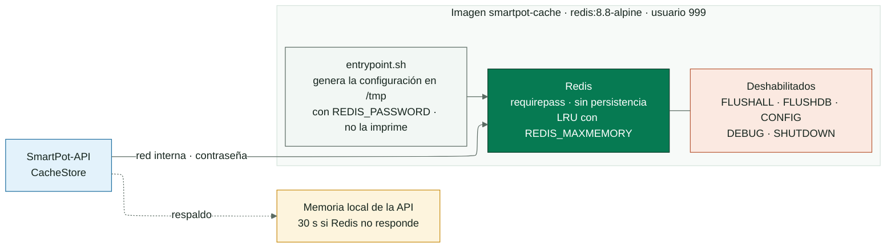

<!-- portada
eyebrow: Documentación del componente
titulo: SmartPot-Cache
acento: Cache
subtitulo: La memoria corta de SmartPot
bajada: Redis endurecido para límites de peticiones, enfriamientos del agente, cachés de la IA y códigos de vinculación de Telegram, sin persistencia y solo en la red interna.
documento: SmartPot-Cache
version: 1.1 · octubre 2026
equipo: SmartPotTech
proyecto: smartpot.app
-->

# SmartPot-Cache

## Ficha del documento

| Campo                          | Valor                                                                                                                                                                                                                                                                                                                                                                                                                                                   |
|--------------------------------|---------------------------------------------------------------------------------------------------------------------------------------------------------------------------------------------------------------------------------------------------------------------------------------------------------------------------------------------------------------------------------------------------------------------------------------------------------|
| Proyecto                       | SmartPot · [smartpot.app](https://smartpot.app)                                                                                                                                                                                                                                                                                                                                                                                                         |
| Componente                     | [SmartPot-Cache](https://github.com/SmartPotTech/SmartPot-Cache)                                                                                                                                                                                                                                                                                                                                                                                        |
| Versión                        | 1.1 · octubre 2026                                                                                                                                                                                                                                                                                                                                                                                                                                      |
| Alcance                        | Llaves y su vida, endurecimiento, comportamiento ante fallas, configuración y pruebas                                                                                                                                                                                                                                                                                                                                                                   |
| Documentación de la plataforma | [Documentación técnica](https://github.com/SmartPotTech/.github/blob/main/docs/SmartPot_Technical_Documentation.md), [recorrido del proyecto](https://github.com/SmartPotTech/.github/blob/main/docs/SmartPot_Project_Journey.md), [ciclo de vida](https://github.com/SmartPotTech/.github/blob/main/docs/SmartPot_Software_Lifecycle.md) y [diagramas generales](https://github.com/SmartPotTech/.github/blob/main/docs/README.md#diagramas-generales) |
| Mantenimiento                  | Se genera desde `docs/` de este repositorio con las herramientas de `.github/docs/tools`; se actualiza con cada cambio del componente                                                                                                                                                                                                                                                                                                                   |

## 1. Propósito

### En palabras simples

Redis guarda datos cortos que la API comparte entre peticiones: cuántas veces pidió algo una IP, cuándo llegó la última
lectura de un cultivo, cuándo actuó el agente por última vez y los códigos de un solo uso para vincular Telegram. Nada
de eso es permanente: si Redis se reinicia, la plataforma sigue y lo reconstruye.

## 2. Arquitectura del componente

<!-- diagrama: SmartPot_Cache_Global_Component | titulo=SmartPot-Cache por dentro -->

## 3. Llaves

```mermaid
%%{init: {"theme": "base", "fontFamily": "Segoe UI, Arial, sans-serif", "themeVariables": {"fontFamily": "Segoe UI, Arial, sans-serif", "fontSize": "15px", "primaryColor": "#DDF5EA", "primaryTextColor": "#17261F", "primaryBorderColor": "#067A52", "secondaryColor": "#E3F2FB", "secondaryTextColor": "#17261F", "secondaryBorderColor": "#1F6FA0", "tertiaryColor": "#F2F7F4", "tertiaryTextColor": "#17261F", "tertiaryBorderColor": "#D5E3DC", "lineColor": "#5B6B63", "textColor": "#17261F", "mainBkg": "#DDF5EA", "nodeBorder": "#067A52", "clusterBkg": "#F7FAF8", "clusterBorder": "#D5E3DC", "edgeLabelBackground": "#FFFFFF", "actorBkg": "#067A52", "actorBorder": "#0B3D2B", "actorTextColor": "#FFFFFF", "actorLineColor": "#5B6B63", "signalColor": "#17261F", "signalTextColor": "#17261F", "labelBoxBkgColor": "#0B3D2B", "labelBoxBorderColor": "#0B3D2B", "labelTextColor": "#FFFFFF", "loopTextColor": "#0B3D2B", "noteBkgColor": "#FDF4DD", "noteBorderColor": "#C98D12", "noteTextColor": "#17261F", "activationBkgColor": "#DDF5EA", "activationBorderColor": "#067A52", "attributeBackgroundColorOdd": "#FFFFFF", "attributeBackgroundColorEven": "#F2F7F4"}}}%%
flowchart TB
  subgraph llaves["Llaves smartpot:*"]
    direction TB
    rate["rate:* · 1 minuto<br/>300 por IP · 10 en /auth"]
    reading["reading:cropId · 5 s<br/>una lectura por cultivo"]
    aieval["ai-eval:cropId · 30 s o 5 min<br/>frecuencia de evaluación"]
    agent["agent:cropId:actuador · 10 min<br/>enfriamiento del agente"]
    notify["notify:* · 1 hora<br/>alertas sin repetir"]
    profiles["ai:crop-profiles · 1 hora<br/>ai:learning-status · 1 minuto"]
    link["channel-link:telegram:código · 10 min<br/>se borra al usarse (GETDEL)"]
    share["crop-share:telegram:código · 10 min<br/>compartir un cultivo con otro chat"]
    weather["weather:lat:lon · 10 min<br/>clima del lugar · 2 min si falló"]
  end
  http["Filtro de peticiones"] --> rate
  mqtt["Telemetría MQTT"] --> reading
  mqtt --> aieval --> agent
  alerts["Notificaciones"] --> notify
  ai["Cliente de la IA"] --> profiles
  tg["Vincular Telegram"] --> link
  tg --> share
  crops["Lugar del cultivo"] --> weather
  classDef leaf fill:#DDF5EA,stroke:#067A52,color:#17261F
  classDef water fill:#E3F2FB,stroke:#1F6FA0,color:#17261F
  classDef sun fill:#FDF4DD,stroke:#C98D12,color:#17261F
  classDef clay fill:#FBE9E1,stroke:#B85A38,color:#17261F
  classDef core fill:#067A52,stroke:#0B3D2B,color:#FFFFFF
  classDef deep fill:#0B3D2B,stroke:#06281C,color:#FFFFFF
  classDef muted fill:#F2F7F4,stroke:#5B6B63,color:#17261F
  class rate,reading,aieval,agent,notify,profiles,link,share,weather leaf
  class http,mqtt,alerts,ai,tg,crops water
```

<!-- diagrama: SmartPot_Cache_01_Keys | titulo=Quién escribe cada llave y cuánto vive -->

## 4. Endurecimiento

| Control       | Detalle                                                                               |
|---------------|---------------------------------------------------------------------------------------|
| Contraseña    | `REDIS_PASSWORD` obligatoria, mínimo 16 caracteres; sin ella el contenedor no arranca |
| Configuración | Se genera en `/tmp` al arrancar y nunca aparece en los logs                           |
| Comandos      | `FLUSHALL`, `FLUSHDB`, `CONFIG`, `DEBUG` y `SHUTDOWN` deshabilitados                  |
| Contenedor    | Usuario `999`, solo lectura y sin capacidades de Linux                                |
| Red           | En producción no publica puertos: solo la API lo alcanza por la red interna           |

## 5. Configuración y pruebas

| Variable          | Por defecto | Uso                                                  |
|-------------------|-------------|------------------------------------------------------|
| `REDIS_PASSWORD`  | —           | Obligatoria                                          |
| `REDIS_MAXMEMORY` | `128mb`     | Memoria máxima; se descartan las llaves menos usadas |
| `REDIS_DATABASES` | `4`         | Bases lógicas                                        |

`sh tests/smoke.sh smartpot-cache:ci` comprueba la autenticación, que `FLUSHALL` y `CONFIG` respondan como comandos
desconocidos, que los logs no muestren la contraseña y que sin contraseña el contenedor no arranque. Cada cambio en
`main` pasa por el CI, publica `ghcr.io/smartpottech/smartpot-cache` y pide el despliegue central de `.github`.
